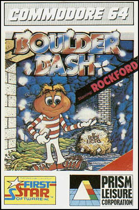
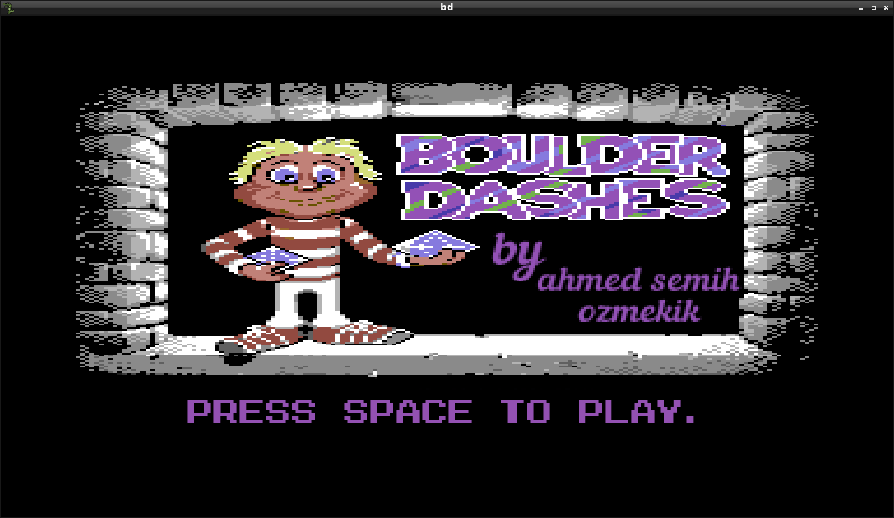
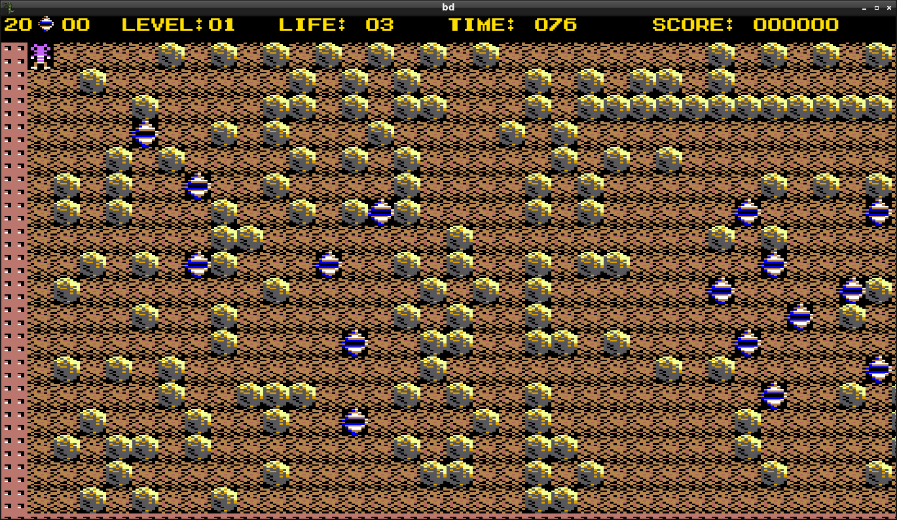

# Boulder-Dash-C-Implementation

The classic game is about diamond chase underground with many obstacles. 
It wasn't it my generation tho. Yet, I do believe that I remember the scenes of my relatives playing this game. "Rockford" escaping from falling rocks, collecting diamonds with style. The most I like about this is game is that especially the sound of walking underground. I wish I used to play this game with Commodore 64. 

Although this was not the first game I coded, it was the first one I fully finished 'til the end. It was a lot fun to code Boulder Dash after all these years. For the honor of the game, I picked the textures and sounds which I believe very similar to the original one's. 

I added some special features such as Monsters and Spiders. Spiders are just hanging around. But the Monsters have -eased- Path finding algorithm for catching Rockford. And there is water which is pretty much bubble. 

I must warn you that this code of mine was written 5 months ago. I sometimes check this code and I really hate it. I hate it so bad that even while I was coding, I was sick of it. Yeah it was fun tho, but it wasn't fun because I was doing a good job with the design of my code or the clearity of my code. The code was spagetti as hell. But it was fun because I was realizing tons of better approaches about clearer design or brighter ideas about implementation, in every second. I didn't be able to implement what was in my mind for the whole code, yet I believe I have learned lots of things from this project. Such as, how to think before code. Or how to seperate models from views and both from controller. 

I did a bad job on this code. But knowing the code was bad made me feel like I was getting to somewhere. Long story short:  

I love this code because I hate it.  

Video: https://www.youtube.com/watch?v=57r9qhH5WCM

Framework used in this project was Allegro btw. And there levels up to 10 which is straightly coming from .txt files and turns into a 2d map. Just so, making the design of creating map of levels simple. 

@author Ahmed Semih Özmekik
@see twitter.com/drh0use1
  
